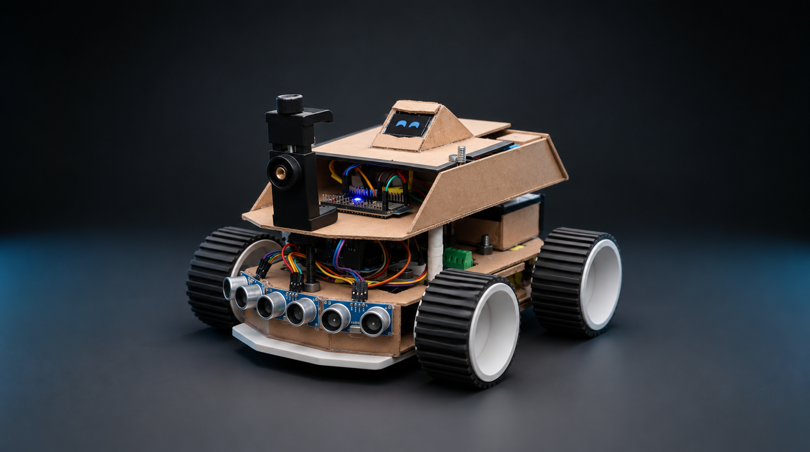
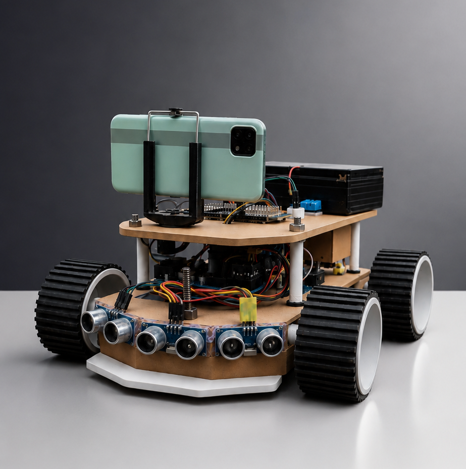
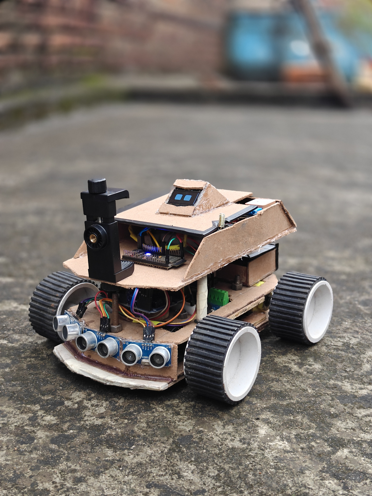
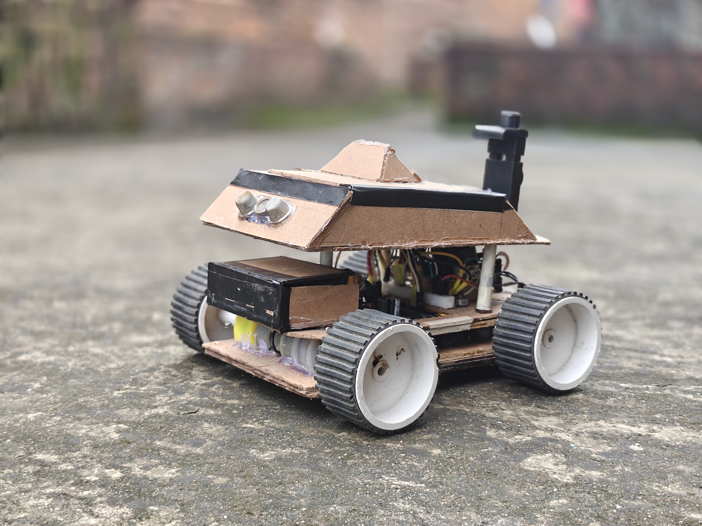

<div align="center">

  

  # 🛰️ CYBERROVER X4.3
  ### Modular Dual-Tier Autonomous Exploration & Environmental Scouting UGV
  **Engineered for Subterranean Coal Mines, Industrial Chemical Hazmat Zones & Structural Disaster Reconnaissance**

  <p align="center">
    <a href="#-project-heritage--evolution-from-x42"></a>
    <a href="LICENSE.md"></a>
    <a href="hardware/MECHANICAL_INTEGRATION.md"></a>
    <a href="firmware/layer2-environmental-node-nano/"></a>
    <a href="software/ground-dashboard/"></a>
  </p>

  <p align="center">
    <a href="#-executive-summary">Overview</a> •
    <a href="#-visual-showcase--hardware-gallery">Gallery</a> •
    <a href="#-key-architectural-innovations">Innovations</a> •
    <a href="#-system-topography">Architecture</a> •
    <a href="#-environmental-instrumentation-deck">Sensors</a> •
    <a href="#-master-pinout-matrix">Pinouts</a> •
    <a href="#-telemetry-protocol--dbms-engine">Telemetry</a> •
    <a href="#-ground-cockpit--presentation-portal">Software</a> •
    <a href="#-quick-start--flashing-guide">Quick Start</a>
  </p>

  <!-- HERO IMAGE -->
  <p align="center">
    
  </p>

</div>

---

## 📋 Executive Summary

In dangerous environments such as **underground coal mines** (prevalent across the Ramgarh / Jharkhand mineral belt), **chemical plant leaks**, and **post-earthquake structural collapses**, human first responders face catastrophic hazards including toxic gas asphyxiation, methane explosions, and structural collapse.

**CyberRover X4.3** is an open-source, dual-deck unmanned ground vehicle (UGV) developed to penetrate, scout, and map extreme disaster zones prior to human entry. Built upon a **hardened, electromagnetically segregated dual-tier architecture**, the platform isolates high-draw motor EMF from micro-volt atmospheric sensors, streaming real-time environmental metrics over kilometer-range Sub-GHz LoRa RF to a tactical ground cockpit with persistent SQLite telemetry logging.

> 🏆 **Project Accolade**: Awarded **1st Prize Winner at the State-Level Science & Technology Exhibition** for excellence in robotics, disaster management, and embedded engineering.

---

## 📸 Visual Showcase & Hardware Gallery

<div align="center">

| Real Rover Studio Scouting Pod | Real Field Reconnaissance |
| :---: | :---: |
|  |  |
| **Tactical Dual-Deck Assembled Unit** | **Rugged Terrain Mobility Verification** |

| Full Physical Assembly & Instrumentation | Rear Atmospheric Gas Array |
| :---: | :---: |
|  |  |
| **Layer 1 Drive + Layer 2 Sensor Standoffs** | **MQ-4 / MQ-7 / MQ-135 Gas Sniffer Pod** |

</div>

---

## 💡 Key Architectural Innovations (X4.2 ➔ X4.3 Evolution)

CyberRover X4.3 is a ground-up physical and electronic redesign of the previous [CyberRover X4.2](https://github.com/veerpratapsaw-code/Cyber_Rover_X4.2-Open-Source) platform:

| Evaluation Metric | Conventional Educational Robots | CyberRover X4.2 (Legacy) | **CyberRover X4.3 (Current Generation)** |
| :--- | :--- | :--- | :--- |
| **Electronic Hierarchy** | Single MCU runs motors + sensors | Monolithic chassis sharing rails | **Segregated Dual-Tier Hierarchy**: Motors on ESP32/Uno, Sensors on Nano |
| **EMF / Brownout Immunity** | Frequent brownouts & ADC noise | Minor jitter on motor spikes | **Zero Motor Back-EMF**: Independent 5V buck regulator & optoisolated grounds |
| **Telemetry Link** | Short-range Bluetooth (<10m) | 2.4 GHz Wi-Fi (<30m line-of-sight) | **Sub-GHz LoRa (RYLR998 @ 868/915 MHz)**: 1+ km penetration through rubble |
| **Onboard Display** | Static 16x2 character LCD | Basic OLED text display | **1.3" I2C Cyber HUD**: Zero-RAM procedural "RoboEyes" + diagnostic screens |
| **Spatial Navigation** | Blind odometry only | Ultrasonic obstacle radar only | **u-blox NEO-6M GPS**: Global coordinates, altitude, sat count, speed & HDOP |
| **Incident Command** | Raw Arduino Serial Monitor | Basic web page | **Tactical Web HUD + SQLite DBMS**: Live artificial horizon, charts & 1-click CSV |
| **Power Management** | Unmonitored 9V or NiMH cells | Basic voltage reading | **Calibrated 3S Li-ion Divider (0.852 Trim)**: Real-time curve & fuel gauge |

*(Read the comprehensive upgrade breakdown in [`CHANGELOG_X4.2_TO_X4.3.md`](CHANGELOG_X4.2_TO_X4.3.md)).*

---

## 🧭 System Topography & Hardware Architecture

CyberRover X4.3 coordinates tasks across specialized, asynchronous microcontrollers connected via multi-protocol RF links:

```
                                  CYBERROVER X4.3 SYSTEM TOPOLOGY
                                                 │
                  ┌──────────────────────────────┴──────────────────────────────┐
                  │                                                             │
                  ▼                                                             ▼
┌───────────────────────────────────────────┐     ┌───────────────────────────────────────────┐
│         LAYER 1: CHASSIS & DRIVE          │     │        LAYER 2: ENVIRONMENTAL DECK        │
│                                           │     │                                           │
│  • 3S Li-ion Battery Pack (11.1V - 12.6V) │     │  • Arduino Nano (Layer 2 Master Node)     │
│  • 5V High-Current Buck Step-Down (3A)    │     │  • MQ-4 Methane / Fire-Damp Sensor (A0)   │
│  • ESP32-S3 Rover Master Mobility MCU     │     │  • MQ-7 Toxic Carbon Monoxide Sensor (A1) │
│  • Dual BTS7960 43A High-Power H-Bridges  │     │  • MQ-135 Hazardous Air Quality / VOC (A2)│
│  • 4WD High-Torque Geared DC Motors       │     │  • Precision 0–25V Battery Divider (A3)   │
│  • Front Ultrasonic Collision Radar       │     │  • BMP280 Digital Barometer / Temp (I2C)  │
│  • Sturdy Aluminum & Acrylic Lower Plate  │     │  • 1.3" High-Contrast I2C OLED HUD        │
│                                           │     │  • u-blox NEO-6M High-Gain GPS (D2/D3)    │
│                                           │     │  • DHT11 Digital Climate Probe (Pin D4)   │
│                                           │     │  • Reyax RYLR998 Sub-GHz LoRa TX (D0/D1)  │
└─────────────────────┬─────────────────────┘     └─────────────────────┬─────────────────────┘
                      │                                                 │
                      │ 2.4 GHz ESP-NOW Failsafe                        │ Sub-GHz LoRa (868 / 915 MHz)
                      ▼                                                 ▼
┌───────────────────────────────────────────┐     ┌───────────────────────────────────────────┐
│        OPERATOR HANDHELD CONTROLLER       │     │     TACTICAL LAPTOP GROUND COCKPIT        │
│                                           │     │                                           │
│  • Dual Hall-Effect Analog Thumbsticks    │     │  • USB-TTL LoRa Base Station Receiver     │
│  • Hardware Emergency Stop Switch (E-Stop)│     │  • SQLite Telemetry Database Engine (DBMS)│
│  • Low-Latency (<5ms) Control Packet Loop │     │  • Real-Time Web HUD & 3D Artificial Horiz│
│  • Live Diagnostic Status LED Indicators  │     │  • Offline High-Resolution GPS Tile Map   │
└───────────────────────────────────────────┘     └───────────────────────────────────────────┘
```

---

## 🧪 Environmental Instrumentation Deck

Layer 2 hosts a dedicated environmental sensing array engineered for rapid hazard detection:

| Sensor Module | Physical Transducer | Target Compounds / Metrics | Operational Range | Hardware Interface | Hazard Threshold |
| :--- | :--- | :--- | :--- | :--- | :--- |
| **MQ-4** | Catalytic $SnO_2$ Metal Oxide | Methane ($CH_4$), Natural Gas, Fire-Damp | 300–10,000 ppm | Analog `A0` (0–5V ADC) | $\ge 700\text{ ADC}$ |
| **MQ-7** | Dual Thermal Cycling Core | Carbon Monoxide ($CO$) | 20–2,000 ppm | Analog `A1` (0–5V ADC) | $\ge 850\text{ ADC}$ |
| **MQ-135** | Broadband Electrochemical | Ammonia ($NH_3$), Benzene, Smoke, VOCs | 10–1,000 ppm | Analog `A2` (0–5V ADC) | $\ge 700\text{ ADC}$ |
| **BMP280** | Piezo-Resistive MEMS | Atmospheric Pressure & Barometric Altitude | 300–1100 hPa ($\pm 1\text{ hPa}$) | Hardware $I^2C$ (`A4/A5`) | Pressure Surge / Drop |
| **DHT11** | Resistive Polymer & NTC | Ambient Temperature & Relative Humidity | 0–50°C / 20–90% RH | Digital GPIO (`D4`) | Heat Index > 45°C |
| **NEO-6M** | 50-Channel GPS Receiver | Latitude, Longitude, Satellites, Speed | Worldwide L1 C/A | SoftwareSerial (`D2/D3`) | Fix Lost / Geo-boundary |
| **Battery Divider** | $30\text{k}\Omega / 7.5\text{k}\Omega$ Divider | Real-Time 3S Li-ion Battery Voltage | 0–25.0V DC ($\pm 0.05\text{V}$) | Analog `A3` (0–5V ADC) | $< 9.60\text{V}$ (Critical) |

---

## ⚡ Master Pinout Matrix (Arduino Nano Layer 2)

```
                       ┌─────────────────────────┐
                       │   ARDUINO NANO PINOUT   │
                       │    (LAYER 2 MASTER)     │
                       └────────────┬────────────┘
     RYLR998 LoRa RX (TTL) ── D0 [RX]   VIN ── 5V Step-Down Buck Rail
RYLR998 TX (via 1k/2k Div) ── D1 [TX]   GND ── Common Star Ground
     u-blox GPS TX (9600)  ── D2 [RX]   RST ── Reset
             (Reserved TX) ── D3 [TX]   +5V ── Sensor VCC Rail
         DHT11 Data Line   ── D4        A7  ── (Aux Analog)
               (Spare PWM) ── D5        A6  ── (Aux Analog)
               (Spare PWM) ── D6        A5  ── BMP280 + OLED [SCL] (I2C)
               (Spare PWM) ── D7        A4  ── BMP280 + OLED [SDA] (I2C)
               (Spare PWM) ── D8        A3  ── 3S Li-ion Divider (0-25V)
               (Spare PWM) ── D9        A2  ── MQ-135 Air Quality Analog
              (Spare GPIO) ── D10       A1  ── MQ-7 Carbon Monoxide Analog
              (Spare GPIO) ── D11       A0  ── MQ-4 Methane / Gas Analog
              (Spare GPIO) ── D12      AREF ── Default 5.0V Reference
              (Builtin LED)── D13      3V3  ── 3.3V Regulated Out
                       └─────────────────────────┘
```

### Pin Interconnect Specifications:
* **`A0`**: MQ-4 Combustible Gas Analog Output.
* **`A1`**: MQ-7 Carbon Monoxide Analog Output.
* **`A2`**: MQ-135 Toxic Air Quality Analog Output.
* **`A3`**: 3S Li-ion Battery Tap through precision voltage divider ($R_1 = 30\text{k}\Omega$, $R_2 = 7.5\text{k}\Omega$, Trim factor $0.852\text{f}$).
* **`A4 (SDA) / A5 (SCL)`**: Shared hardware $I^2C$ bus communicating with the 1.3" OLED HUD (`0x3C`) and the BMP280 Barometer (`0x76`).
* **`D0 (RX) / D1 (TX)`**: Hardware Serial to Reyax RYLR998 LoRa module (115200 baud). *Note: TX line utilizes a 1kΩ/2kΩ resistor divider to protect 3.3V LoRa logic levels.*
* **`D2 (RX)`**: SoftwareSerial receiving NMEA GPS sentences from u-blox NEO-6M at 9600 baud.
* **`D4`**: Single-bus digital communication with DHT11 temperature and humidity sensor.

---

## 📡 Telemetry Protocol & SQLite DBMS Engine

Layer 2 broadcasts a non-blocking CSV telemetry string every **1.5 seconds** over LoRa:

```
CR43,<pkt_id>,<batt_v>,<mq4_adc>,<mq7_adc>,<mq135_adc>,<dht_temp>,<dht_hum>,<bmp_temp>,<bmp_press>,<bmp_alt>,<gps_fix>,<lat>,<lon>,<sats>,<hdop>,<gps_alt>,<speed>
```

### Packet Field Definitions:
1. `CR43`: Header tag validating protocol compatibility.
2. `pkt_id`: Monotonically increasing 32-bit sequence counter for packet drop analysis.
3. `batt_v`: Calibrated battery pack voltage (e.g. `12.14`).
4. `mq4_adc`: Raw 10-bit ADC count for methane (0–1023).
5. `mq7_adc`: Raw 10-bit ADC count for carbon monoxide (0–1023).
6. `mq135_adc`: Raw 10-bit ADC count for toxic VOCs (0–1023).
7. `dht_temp`: Ambient temperature from DHT11 in °C.
8. `dht_hum`: Ambient relative humidity from DHT11 in %.
9. `bmp_temp`: Precision barometric temperature in °C.
10. `bmp_press`: Atmospheric pressure in Pascals (e.g. `100845`).
11. `bmp_alt`: Calculated barometric altitude in meters above sea level.
12. `gps_fix`: Binary GPS fix lock status (`1` = valid fix, `0` = searching).
13. `lat` / `lon`: High-precision WGS84 geographic coordinates.
14. `sats`: Visible satellite vehicle count.
15. `hdop`: Horizontal Dilution of Precision metric.
16. `gps_alt`: Altitude metric calculated by satellite triangulation.
17. `speed`: Rover ground velocity in km/h.

### SQLite Database Schema (`mission_telemetry.db`):
Every packet received by the laptop USB base station is committed to an ACID-compliant SQLite relational database:

```sql
CREATE TABLE IF NOT EXISTS telemetry_logs (
    id INTEGER PRIMARY KEY AUTOINCREMENT,
    timestamp DATETIME DEFAULT CURRENT_TIMESTAMP,
    packet_id INTEGER,
    battery_v REAL,
    mq4_raw INTEGER,
    mq7_raw INTEGER,
    mq135_raw INTEGER,
    dht_temp REAL,
    dht_hum REAL,
    bmp_temp REAL,
    bmp_press REAL,
    bmp_alt REAL,
    gps_fix INTEGER,
    latitude REAL,
    longitude REAL,
    satellites INTEGER,
    hdop REAL,
    speed_kmh REAL
);
```

---

## 🖥️ Ground Cockpit & Presentation Portal

The CyberRover ecosystem includes dual operator software suites:

### 1. Tactical Ground Station Dashboard (`software/ground-dashboard/`)
* **Live Environmental Oscilloscope**: Multi-trace real-time canvas charting gas spikes, pressure drops, and battery discharge.
* **3D Inclinometer & Artificial Horizon**: Visual pitch/roll indicators warning against rover rollover on steep rubble.
* **Offline GPS Navigation**: Pre-downloaded OpenStreetMap tiles allowing satellite tracking deep underground without internet access.
* **1-Click Emergency Incident Export**: Instant CSV generation for emergency rescue commanders.

### 2. Interactive 3D Presentation Website (`09_Presentation_website/`)
A high-aesthetic React + Vite presentation application for judges and technical review panels featuring:
* Interactive 3D model inspector and subsystem breakdown.
* Dynamic sensor sandbox simulating toxic gas plume encounters.
* Full technical changelog and project timeline explorer.

To run the presentation portal:
```bash
cd "09_Presentation_website"
npm install
npm run dev
# Opens at http://localhost:5173
```

---

## 🛠️ Quick Start & Flashing Guide

### Hardware Prerequisites:
1. **Microcontrollers**: Arduino Nano (ATmega328P Old Bootloader or New Bootloader) + ESP32-S3.
2. **Sensors**: MQ-4, MQ-7, MQ-135, BMP280, DHT11, u-blox NEO-6M GPS.
3. **Display & Comms**: 1.3" I2C OLED (SH1106 / SSD1306), Reyax RYLR998 LoRa transceiver module.
4. **Power System**: 3S Li-ion battery pack (11.1V nominal), 5V 3A buck converter, precision $30\text{k}\Omega / 7.5\text{k}\Omega$ resistors.

### Flashing Layer 2 Firmware:
1. Open the [Arduino IDE](https://www.arduino.cc/en/software).
2. Install required libraries from Library Manager:
   * `Adafruit SSD1306` & `Adafruit GFX`
   * `Adafruit BMP280 Library`
   * `DHT sensor library`
   * `TinyGPSPlus`
3. Open `firmware/layer2-environmental-node-nano/layer2-environmental-node-nano.ino`.
4. Select board: **Arduino Nano**, Processor: **ATmega328P (Old Bootloader)**.
5. Connect USB cable and click **Upload**.

### Launching Ground Station:
```bash
# Navigate to software directory:
cd "software/ground-dashboard"

# Start the ground station server (auto-detects USB LoRa serial port):
python ground_station.py

# Or launch via batch script:
start_ground_station.bat
```

---

## 📁 Repository File Tree

```
cyberrover x4.3/
├── README.md                            # Comprehensive project overview & technical manual
├── CHANGELOG_X4.2_TO_X4.3.md            # Detailed generation comparison & upgrade analysis
├── EXHIBITION_PROJECT_REPORT.md         # Official State Exhibition synopsis & scientific paper
├── EXHIBITION_SPEECH_SCRIPT_HINGLISH.md # Live demonstration pitch & judge Q&A guide
├── LICENSE.md                           # Open-source MIT license
│
├── hardware/
│   ├── POWER_GRID_AND_WIRING.md         # Power topology, buck regulators, star grounding & schematics
│   └── MECHANICAL_INTEGRATION.md        # Dual-deck dimensions, standoff zones & binnacle structure
│
├── firmware/
│   └── layer2-environmental-node-nano/  # Arduino Nano Layer 2 environmental firmware
│       ├── layer2-environmental-node-nano.ino # Non-blocking cooperative scheduler loop
│       ├── Config.h                     # Hardware pin assignments & calibration trims
│       ├── Sensors.h                    # 7-channel acquisition & sanity validation engine
│       ├── DisplayOLED.h                # 1.3" OLED procedural RoboEyes & telemetry pages
│       ├── LoRaTransceiver.h            # RYLR998 AT command serialization & LoRa broadcast
│       └── README.md                    # Firmware compilation and calibration instructions
│
├── software/
│   └── ground-dashboard/                # Tactical ground cockpit & telemetry server
│       ├── ground_station.py            # Serial listener, WebSocket broadcaster & SQLite logger
│       ├── mission_telemetry.db         # Persistent SQLite database storing live mission data
│       ├── index.html                   # Mission control tactical HUD interface
│       ├── app.js                       # Frontend oscilloscope, artificial horizon & charts
│       ├── style.css                    # High-contrast cyber-tactical CSS theme
│       └── tiles/                       # Offline GPS map tiles for deep underground operation
│
└── 09_Presentation_website/             # Interactive 3D web presentation for exhibition judges
    ├── src/                             # React application source code
    │   ├── assets/                      # High-resolution CAD renders & hardware photography
    │   └── components/                  # 3D views, telemetry simulators & interactive sections
    ├── package.json                     # Vite & React dependencies
    └── vite.config.js                   # Development & build configuration
```

---

## 👥 Contributors & Open Source Attribution

* **Lead Innovator / Developer**: Sanjay & Team
* **Institutional Recognition**: 1st Prize Winner — State Level Science & Technology Exhibition
* **Project Lineage**: Evolved from the open-source robotics research of CyberRover X4.2 by Veer Pratap Saw.

Distributed under the **MIT License**. See [`LICENSE.md`](LICENSE.md) for full legal text.
